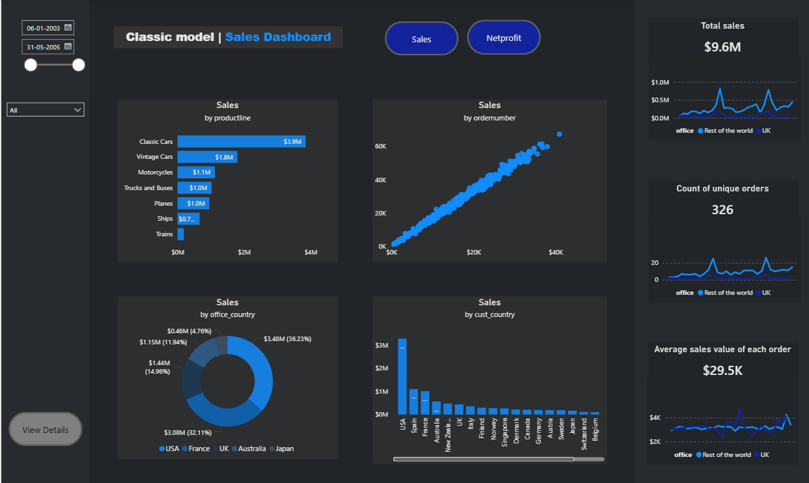
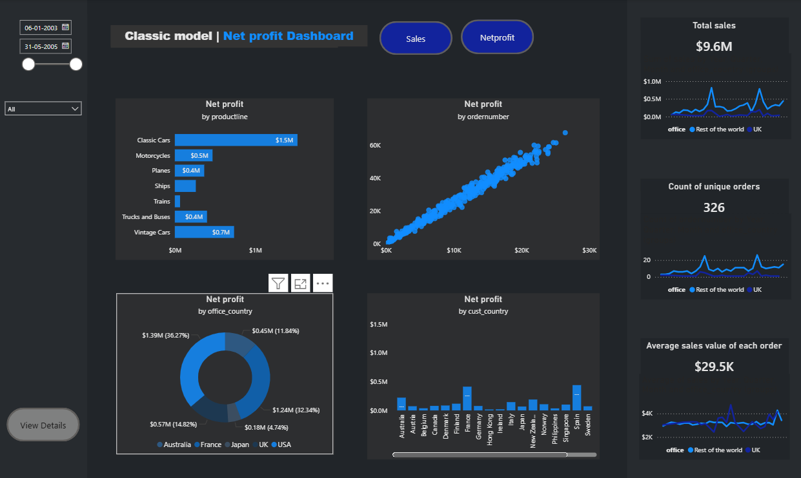

# Classic Model Sales Dashboard

An interactive Power BI dashboard built on Classic Model sales data.

## Features
- Bookmark-based navigation (Sales & Net Profit views)
- Dynamic title switching
- Date range slicer & country filter
- Decomposition tree analysis
- MoM% and YTD calculations

## Dashboard Preview

### Sales Dashboard

### Net Profit Dashboard

## Tools Used
## Tools Used
- Power BI Desktop
- MySQL (data source)
- DAX (MoM%, YTD measures)
- Bookmarks & Navigation

## Dataset
- Source: Classic Models database
- Records: Sales transactions from 2003–2005
- Key fields: Product line, Customer country, Order number, Sales, Net Profit
